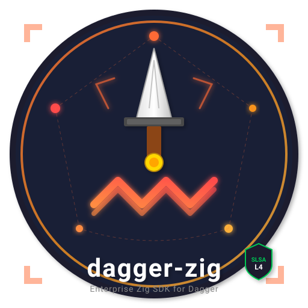

<p align="center">
  
</p>

<h1 align="center">dagger-zig</h1>

<p align="center">
  <strong>A native Zig SDK for <a href="https://dagger.io">Dagger</a> that builds, tests, and releases itself.</strong>
</p>

<p align="center">
  <a href="https://github.com/MChorfa/dagger-zig/releases"></a>
  <a href="https://github.com/MChorfa/dagger-zig/actions/workflows/ci.yml"></a>
  <a href="https://ziglang.org"></a>
  <a href="LICENSE"></a>
</p>

---

dagger-zig is a **Zig stdlib-only** SDK for the Dagger programmable CI/CD engine. It gives you a synchronous Dagger client, module authoring with comptime type reflection, and concurrent fan-out via `std.Io.Group` + `Client.branch()`.

The project dogfoods its own tooling: the pipeline in [`ci/`](ci/) is a Zig Dagger module built with this SDK, and every tagged release ships SBOMs, Sigstore signatures, and SLSA Build L3 provenance. See [docs/compliance.md](docs/compliance.md) for the full supply-chain story.

## See it work

Run the example pipeline in two commands:

```bash
dagger run -- zig build run-first-pipeline
```

```text
hello from zig
```

Or run the self-hosting CI module that builds the SDK with itself:

```bash
dagger call -m ./ci/pipeline run --arg-0 .
```

## Quick start

```zig
const std = @import("std");
const dagger = @import("dagger_sdk");

pub fn main() !void {
    var gpa_state: std.heap.GeneralPurposeAllocator(.{}) = .{};
    defer _ = gpa_state.deinit();
    const gpa = gpa_state.allocator();

    var io_impl: std.Io.Threaded = .init(gpa, .{});
    defer io_impl.deinit();
    const io = io_impl.io();

    var client = try dagger.connect(gpa, io, .{});
    defer client.close();

    const out = try client.dag()
        .container()
        .from("alpine:latest")
        .withExec(&.{ "echo", "hello from zig" })
        .stdout();
    defer gpa.free(out);

    std.debug.print("{s}", .{out});
}
```

## What works

| Feature | What you get |
| --- | --- |
| **Client API** | Synchronous Dagger API for Linux/macOS: containers, directories, files, secrets, cache volumes, services, git |
| **Module authoring** | Expose a Zig struct with `dagger.module.serve(...)`. Comptime reflection maps types to Dagger `TypeDef`s; unmappable signatures fail at `zig build` |
| **Concurrent fan-out** | `dagger.parallel` over `std.Io.Group` with `Client.branch()` per task. See [examples/parallel](examples/parallel/main.zig) |
| **Tracing** | OpenTelemetry-compatible spans via `dagger.tracing` |
| **CLI lifecycle** | Three-tier handshake: `dagger run --` env → `_EXPERIMENTAL_DAGGER_CLI_BIN` → `dagger` on `$PATH`. No auto-downloads |
| **SPIFFE/SPIRE** | Experimental shellout backend; build with `-Dspiffe-experimental`. See [docs/spiffe.md](docs/spiffe.md) |
| **Self-hosting CI** | Build, test, scan, docs, and release pipeline as a Zig Dagger module |

## Author a Dagger module in Zig

```zig
const std = @import("std");
const dagger = @import("dagger_sdk");

const MyModule = struct {
    pub fn build(
        self: *const MyModule,
        ctx: *dagger.module.Context,
        source: dagger.Directory,
    ) !dagger.Container {
        _ = self;
        return try ctx.container()
            .from("golang:1.23-alpine")
            .withDirectory("/src", source)
            .withWorkdir("/src")
            .withExec(&.{ "go", "build", "./..." });
    }
};

pub fn main(init: std.process.Init) !void {
    return dagger.module.serve(init, MyModule{});
}
```

```json
{
  "name": "my-pipeline",
  "sdk": "github.com/MChorfa/dagger-zig/sdk@v0.3.5",
  "source": "."
}
```

```bash
dagger develop                 # codegen → build.zig + build.zig.zon + internal/dagger/dagger.gen.zig
dagger call build --source=.
```

More examples: [parallel pipelines](examples/parallel/main.zig), [C/Python FFI](examples/c-client/), [SPIFFE registry auth](docs/spiffe.md), and the [e2e module](examples/e2e-module/).

## Planned

Windows support, the C ABI (`zig build c-lib`), the native SPIFFE Workload API, and per-module codegen are typed or skeletoned but disabled to avoid `error.NotImplemented` paths. See [docs/roadmap.md](docs/roadmap.md).

## Learn more

| Document | Purpose |
| --- | --- |
| [getting-started](docs/getting-started.md) | Your first dagger-zig project |
| [module-authoring](docs/module-authoring.md) | Build Dagger modules in Zig |
| [architecture](docs/architecture.md) | Design rationale and internals |
| [build](docs/build.md) | Build flags, tests, and release commands |
| [compliance](docs/compliance.md) | Security practices and release provenance |
| [roadmap](docs/roadmap.md) | What's planned |

## Contributing

```bash
make build && make test            # build + run tests
make fmt && make lint              # format + lint
```

Test GitHub Actions workflows locally with [`act`](https://github.com/nektos/act) — see [docs/local-ci-testing.md](docs/local-ci-testing.md). Optional CI secrets skip cleanly when unset.

A community SDK for [Dagger](https://dagger.io), following the official SDK patterns and engine contract.

## License

Apache-2.0 — see [LICENSE](LICENSE).
