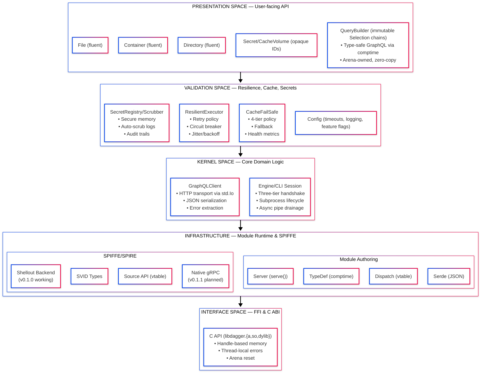
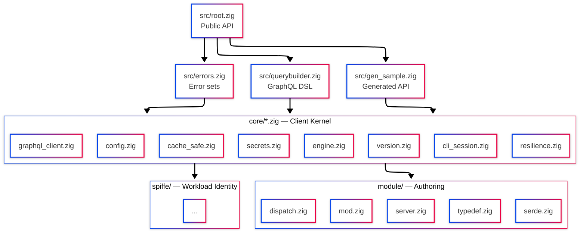
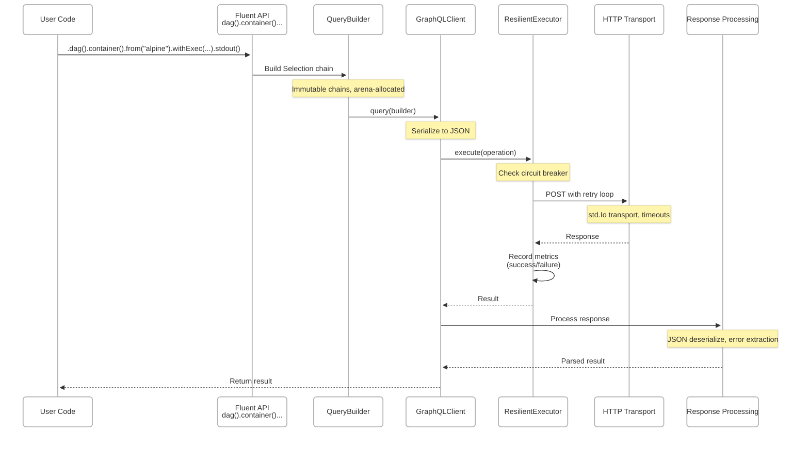
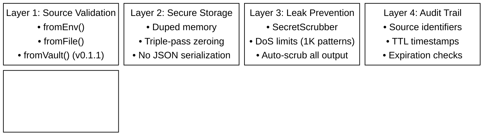
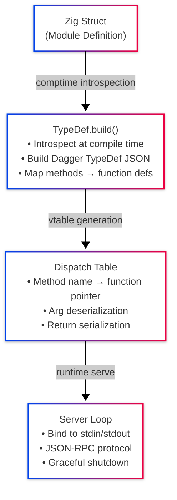
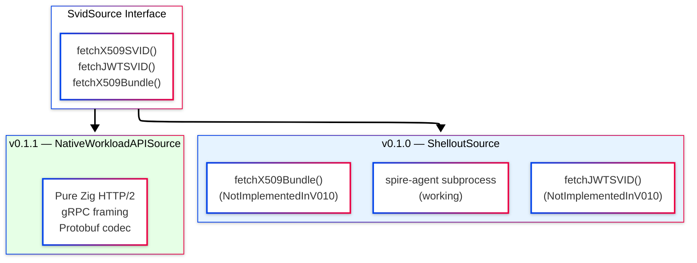
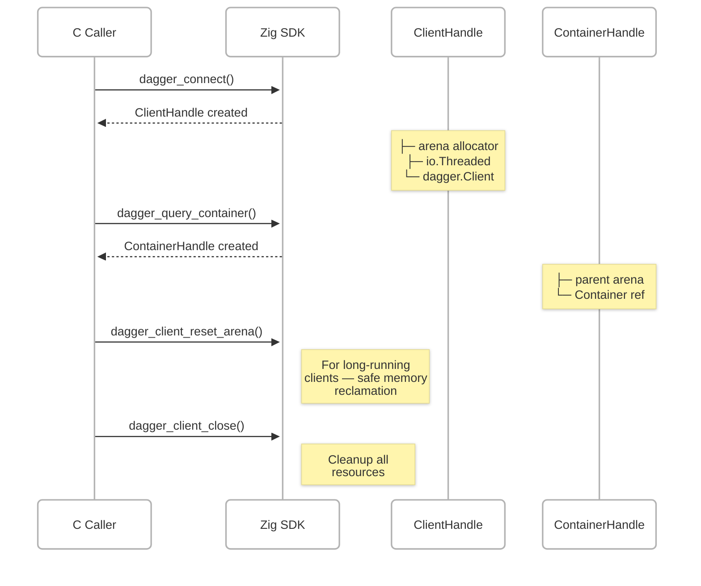
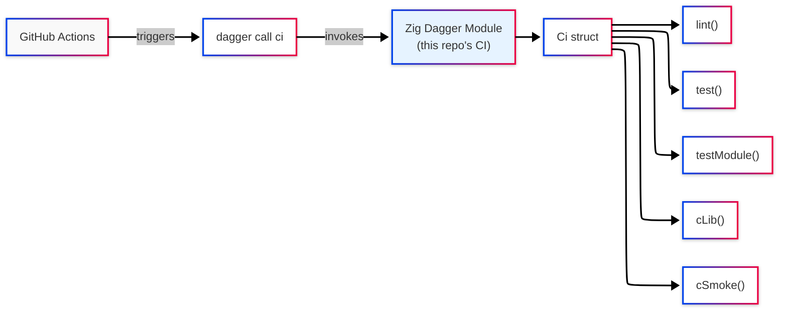

# dagger-zig Architectural Documentation

**Version**: v0.1.0-RC  
**Date**: 2026-04-24

---

## Overview

This SDK provides a native Zig interface to the Dagger CI/CD engine. The architecture follows structured separation of concerns:

1. **Operational observability** — All operations produce metrics and audit trails
2. **Security hardening** — Automatic secret scrubbing and secure memory handling
3. **Self-hosting validation** — CI pipeline uses the SDK itself for verification

---

## Architectural Layers



---

## Module Dependency Graph



---

## Data Flow: Client Request



---

## Resilience Architecture

### Circuit Breaker State Machine

````mermaid
---
config:
  theme: neo
  layout: elk
  look: neo
---
stateDiagram-v2
    [*] --> Closed: Initialize

    Closed --> Closed: Success (reset counter)
    Closed --> Open: Failure count ≥ threshold

    Open --> HalfOpen: skip_requests elapsed
    Open --> Open: Requests blocked

    HalfOpen --> Closed: Success (success_threshold reached)
    HalfOpen --> Open: Failure (immediate)

    note right of Closed
        Normal operation
        Requests allowed
    end note

    note right of Open
        Circuit broken
        Requests blocked
        Skip counter running
    end note

    note right of HalfOpen
        Probing mode
        Limited requests
        Testing recovery
    end note

### Retry Pattern

```text
Attempt 0: Immediate (no delay)
Attempt 1: 100ms + jitter(±10%)
Attempt 2: 200ms + jitter(±10%)
Attempt 3: 400ms + jitter(±10%)
...
Max: 5000ms (capped)
````

**Input Validation**:

- NaN/Inf protection on jitter_factor
- Overflow protection on counter increments
- f32 precision guards (maximum representable: 2^24)
- Input validation caps (max_retries <= 100, max_backoff <= 1hr)

---

## Cache Fail-Safe Architecture

### Policy Matrix

| Policy    | Use Cache? | Write Cache? | Failure Behavior                               |
| --------- | ---------- | ------------ | ---------------------------------------------- |
| disabled  | No         | No           | N/A (skip)                                     |
| auto      | Yes        | Yes          | Fallback to uncached, increment fallback count |
| required  | Yes        | Yes          | Propagate error (cache is mandatory)           |
| read_only | Yes        | No           | Fallback to uncached (no writes)               |

### Health Monitoring

```mermaid
---
config:
  theme: neo
  layout: elk
  look: neo
---
mindmap
  root((CacheFailSafe))
    CircuitBreaker
      ::icon(fa-shield)
      Independent from GraphQL
    Metrics
      lookups
      hits
      misses
      fallbacks
      total_wait_ms
    Logger
      ::icon(fa-file-text)
      Optional operational visibility
```

---

## Secret Management Architecture

### Security Layers



---

## Module Authoring Architecture

### Comptime Type Mapping



---

## SPIFFE/SPIRE Integration

### Architecture Pattern: Vtable + Backend



**Note**: Same interface, different backends. Users can upgrade from shellout to native without source changes.

---

## C FFI Architecture

### Memory Model



### Safety Guarantees

1. **Handle validity**: Post-close use is UB (documented)
2. **Thread-local errors**: `dagger_last_error()` per thread
3. **Arena reset**: Safe memory reclamation without freeing
4. **No panics**: All Zig errors caught and mapped to codes

---

## Build System Architecture

### Target Matrix

| Build Step       | Purpose                                 |
| ---------------- | --------------------------------------- |
| lib (default)    | `@import("dagger_sdk")` module          |
| test             | Offline unit tests (41 tests)           |
| test-module      | Comptime module E2E                     |
| test-integration | Live engine tests                       |
| c-lib            | libdagger.{a,so,dylib} + headers        |
| c_smoke          | C client against live engine            |
| matrix           | Cross-compile (5 targets)               |
| sbom             | CycloneDX via syft                      |
| slsa             | SLSA v1.0 provenance                    |
| ci               | Full pipeline (lint→test→c_lib→c_smoke) |

### Self-Hosting CI



The CI pipeline uses the Zig module runtime for self-validation.

---

## Evidence-Native Engineering

Every meaningful operation produces evidence:

| Component  | Evidence Produced | Format                                                   |
| ---------- | ----------------- | -------------------------------------------------------- |
| Resilience | ResilienceMetrics | Struct (total_requests, failed, retried, circuit_events) |
| Cache      | CacheMetrics      | Struct (lookups, hits, misses, fallbacks)                |
| Secrets    | AuditSource       | String (vault:kv/data/db#password)                       |
| Build      | SBOM              | CycloneDX JSON                                           |
| Build      | Provenance        | SLSA v1.0 predicate                                      |
| CI         | Pipeline logs     | Structured, secret-scrubbed                              |

---

## Risk Assessment

| Risk                 | Mitigation                               | Status      |
| -------------------- | ---------------------------------------- | ----------- |
| Zig 0.16 API drift   | COMPILE_STATUS.md tracks all speculation | Verified    |
| Memory leaks         | Arena allocator, resetArena() API        | Protected   |
| Secret leaks         | Auto-scrubbing, secure zeroing           | Hardened    |
| Retry storms         | Jitter, circuit breaker, max_backoff     | Hardened    |
| Cache unavailability | 4-tier policies, graceful degradation    | Implemented |

1. **Comptime Type Safety**: GraphQL queries validated at compile time
2. **Zero-Copy Where Possible**: Arena allocation for Selection chains
3. **Vtable Pattern**: SPIFFE backends swappable without source changes
4. **Self-Hosting**: CI validates the module runtime in production
5. **Observability**: All resilience decisions produce metrics

---

## Recommended Reading Order for Reviewers

1. **src/root.zig** — Public API surface
2. **src/core/resilience.zig** — Resilience patterns
3. **src/core/cache_safe.zig** — Cache fail-safe
4. **src/core/secrets.zig** — Security architecture
5. **ci/main.zig** — Self-hosting validation
6. **src/c_api.zig** — FFI implementation

---

## Conclusion

The dagger-zig SDK provides a complete implementation with structured resilience patterns, automatic secret management, and cache fail-safe mechanisms. The self-hosting CI pipeline validates all functionality end-to-end.

**Status**: Ready for technical review.
