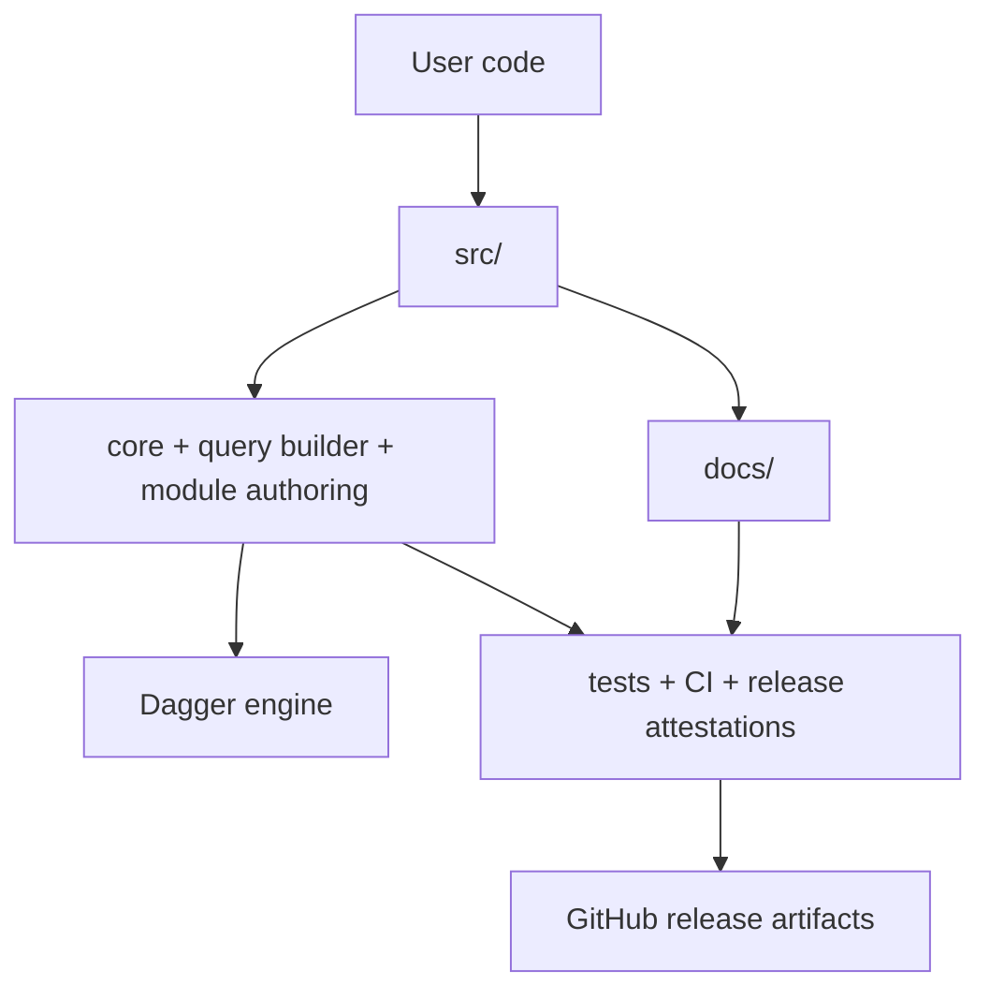

# Architectural Map

This page is the shortest possible map of the repository. It shows where to go
when you want to change runtime behavior, docs, CI, or release plumbing.

## Top-Level Flow

## Repository Map

| Area | Purpose | Start here |
| --- | --- | --- |
| `src/` | Public SDK surface, query builder, tracing, module/runtime glue | `src/root.zig` |
| `ci/` | Self-hosting pipeline written in Zig and executed by Dagger | `ci/` |
| `examples/` | Copyable end-to-end usage samples | `examples/parallel/main.zig` |
| `docs/` | User-facing docs, architecture notes, release guidance | `docs/README.md` |
| `scripts/` | Local verification and release helpers | `scripts/release-verify.sh` |
| `sdk/` | Bootstrap layer that loads the Zig module | `sdk/` |
| `tests/` | Offline and integration tests | `tests/` |

## Runtime Boundaries

| Layer | Responsibility | Notes |
| --- | --- | --- |
| Public API | Fluent client, handles, module serving | Synchronous and predictable |
| Core runtime | Query construction, transport, resilience | Owns mutable state and error handling |
| Parallel helpers | Fan-out over `std.Io.Group` | Requires `Client.branch()` per task |
| Proof layer | CI, checks, attestations, release validation | Keeps build output and release evidence separate |

## Request Lifecycle

1. User code builds a query through the fluent API.
2. Query builder creates the GraphQL selection tree.
3. `GraphQLClient` serializes and sends the request.
4. Resilience wrappers apply retry and circuit-breaker policy.
5. Response parsing converts the engine result back into typed Zig values.
6. CI and release jobs verify the same paths offline before publishing.

## What Changed Recently

| Area | Current direction |
| --- | --- |
| Concurrency | `dagger.parallel` and `Client.branch()` for safe fan-out |
| Docs | Short, task-focused pages instead of long architecture dumps |
| Release | Tagged releases publish provenance, attestation, and signed artifacts |
| CI | Workflow jobs are Dagger-driven and keep GitHub Actions thin |

## Related Pages

- [Architecture](architecture.md)
- [Async Patterns](async-patterns.md)
- [Build Guide](build.md)
- [Compliance](compliance.md)
- [Observability](observability.md)
