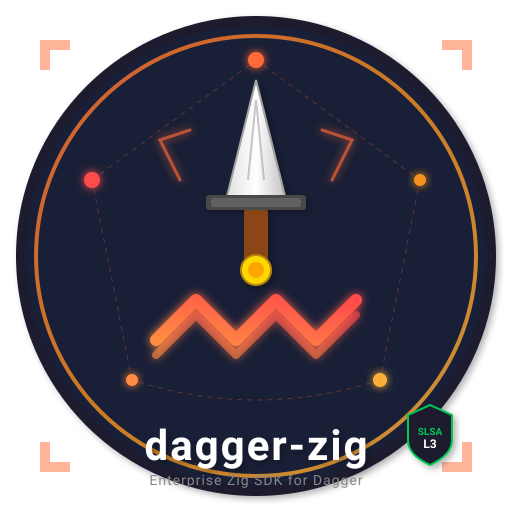

  

<h1 align="center">dagger-zig Docs</h1>

  <strong>A practical guide to the Zig SDK for the <a href="https://dagger.io">Dagger</a> programmable CI/CD engine.</strong>

  <a href="https://dagger.io">Website</a> ·
  <a href="https://docs.dagger.io">Dagger Docs</a> ·
  <a href="https://github.com/dagger/dagger">GitHub</a> ·
  <a href="https://discord.gg/dagger">Discord</a>

---

## At a glance

| | |
| --- | --- |
| **SDK dependencies** | Zero external dependencies; Zig stdlib only |
| **Zig baseline** | 0.16 |
| **Client model** | Synchronous API with `std.Io.Group` fan-out |
| **Extras** | Offline benchmarks, release provenance, SPIFFE support |

## Read this first

This docs set is arranged in the order most people need it:

| Path | Use it for |
| --- | --- |
| [Getting Started](getting-started.md) | First build, first client, local setup |
| [Examples](examples.md) | Copyable end-to-end snippets |
| [Build Guide](build.md) | Build flags, tests, and release commands |
| [Client API](api-reference.md) | Core SDK surface area |
| [Module Authoring](module-authoring.md) | Exposing Zig structs as Dagger modules |
| [Async Patterns](async-patterns.md) | Parallel fan-out with `std.Io.Group` and `Client.branch()` |
| [Compliance](compliance.md) | What the release pipeline actually ships |
| [Observability](observability.md) | Tracing, logs, metrics, and health checks |

## Design principles

| Principle | Meaning |
| --- | --- |
| Small surface | Keep the public API synchronous and predictable |
| Explicit state | Branch per concurrent task instead of sharing mutable clients |
| Honest docs | Mark experimental and deferred pieces clearly |
| Build-proof releases | Separate build artifacts from release attestations |
| Local-first validation | Prefer offline checks and reproducible commands |

## What is stable

| Area | Status | Notes |
| --- | --- | --- |
| Client SDK | Ready | POSIX, synchronous, zero third-party runtime deps |
| Module authoring | Ready | Compile-time type mapping with early failures |
| Parallel fan-out | Ready | `dagger.parallel` + `Client.branch()` |
| Tracing | Ready | OpenTelemetry-compatible spans |
| Release provenance | Ready | SLSA L3 + GitHub attestation + cosign on tagged releases |

## What is experimental

| Area | Status | Notes |
| --- | --- | --- |
| SPIFFE/SPIRE | Experimental | Shellout backend works; native workload API remains a skeleton |
| Windows support | Planned | POSIX is the shipped baseline |
| C ABI | Planned | Not yet promoted to the primary path |

## Where to go next

1. [Getting Started](getting-started.md) for a first successful call.
2. [Examples](examples.md) for copyable patterns.
3. [Compliance](compliance.md) for release provenance and signing.
4. [Roadmap](roadmap.md) for what is still deferred.
