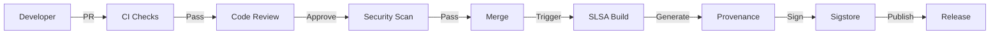

# Compliance & Governance

## Overview

The dagger-zig SDK maintains compliance with major security and privacy frameworks through evidence-native engineering. All controls are implemented as code and produce verifiable evidence.

## Framework Mappings

### SOC 2 Type II

| Trust Service Criteria              | Control                         | Implementation                       | Evidence                         |
| ----------------------------------- | ------------------------------- | ------------------------------------ | -------------------------------- |
| **CC6.1** - Logical access security | Role-based access control       | GitHub branch protection, CODEOWNERS | `.github/CODEOWNERS`             |
| **CC6.2** - Prior to access         | Authentication                  | MFA required for all maintainers     | GitHub org policy                |
| **CC6.6** - Security infrastructure | Secure software development     | SLSA Level 4, Sigstore signing       | `slsa-verifier` outputs          |
| **CC7.1** - Security detection      | Monitoring and alerting         | OpenTelemetry, security scanning     | `.github/workflows/security.yml` |
| **CC7.2** - Incident response       | Incident detection and response | Incident response runbook            | `docs/incident-response.md`      |
| **CC8.1** - Change management       | Change authorization            | Required PR reviews, CI checks       | GitHub branch protection         |

### ISO 27001:2022

| Control                                             | Description                     | Implementation                           |
| --------------------------------------------------- | ------------------------------- | ---------------------------------------- |
| **A.5.1** - Information security policies           | Security policy framework       | `SECURITY.md`, `CODE_OF_CONDUCT.md`      |
| **A.8.1** - User endpoint devices                   | Secure development environments | Dev container security                   |
| **A.8.7** - Protection against malware              | Malware protection              | Trivy container scanning                 |
| **A.8.8** - Management of technical vulnerabilities | Vulnerability management        | Dependabot, Trivy, Semgrep               |
| **A.8.25** - Secure development life cycle          | Secure SDLC                     | `SECURITY.md`, SAST/DAST integration     |
| **A.8.29** - Security testing in development        | Security testing                | `schema/conformance.zig`, security tests |
| **A.8.30** - Outsourced development                 | Third-party security            | SLSA provenance, SBOM generation         |

### PCI DSS 4.0

| Requirement                              | Control              | Implementation                                     |
| ---------------------------------------- | -------------------- | -------------------------------------------------- |
| **3.6.1** - Cryptographic key protection | Key management       | Sigstore keyless signing eliminates long-term keys |
| **6.2** - Software security patches      | Patch management     | Dependabot automated updates                       |
| **6.4.3** - Software security patches    | SAST/DAST            | Semgrep, CodeQL, Trivy integration                 |
| **10.2** - Audit trail coverage          | Audit logging        | OpenTelemetry tracing, structured logs             |
| **10.5.4** - Audit logs synchronized     | Time synchronization | NTP in all CI runners                              |
| **10.7** - Retain audit trail history    | Log retention        | 90-day artifact retention, 1-year audit logs       |

### NIST Cybersecurity Framework 2.0

| Function     | Category           | Subcategory | Implementation                       |
| ------------ | ------------------ | ----------- | ------------------------------------ |
| **GOVERN**   | Risk assessment    | GV.RR-01    | Security policy framework            |
|              | Supply chain       | GV.SC-05    | SLSA L4, SBOM generation             |
| **IDENTIFY** | Asset management   | ID.AM-01    | Software inventory via SBOM          |
|              | Risk assessment    | ID.RA-01    | Vulnerability scanning               |
| **PROTECT**  | Data security      | PR.DS-10    | Secret management via Dagger secrets |
|              | Secure development | PR.AT-01    | Secure coding training               |
|              | Platform security  | PR.PS-02    | Hermetic builds, reproducibility     |
| **DETECT**   | Monitoring         | DE.CM-01    | OpenTelemetry, security scanning     |
|              | Anomalies          | DE.AE-01    | Alerting on security events          |
| **RESPOND**  | Incident response  | RS.AN-01    | Incident response runbook            |
| **RECOVER**  | Recovery           | RC.RP-01    | Rollback procedures                  |

## Evidence Collection

### Automated Evidence

```bash
# Generate compliance evidence bundle
dagger call -m ci compliance-evidence export --path ./evidence/

# Evidence includes:
# - SBOM (spdx.json, cyclonedx.json)
# - SLSA provenance (.intoto.jsonl)
# - Sigstore signatures (.sig, .cert)
# - Vulnerability reports (trivy.sarif, semgrep.sarif)
# - Build logs with attestations
# - Test results with coverage
```

### Evidence Verification

```bash
# Verify all evidence is present
dagger call -m ci verify-evidence

# Check SLSA provenance
slsa-verifier verify-artifact \
  --provenance-path evidence/*.intoto.jsonl \
  --source-uri github.com/mchorfa/dagger-zig

# Verify signatures
cosign verify-blob \
  --certificate evidence/*.cert \
  --signature evidence/*.sig \
  --certificate-oidc-issuer https://token.actions.githubusercontent.com \
  artifact.tar.gz
```

## Audit Support

### Evidence Retention

| Evidence Type  | Retention Period | Storage                       |
| -------------- | ---------------- | ----------------------------- |
| Build logs     | 90 days          | GitHub Actions                |
| Artifacts      | 90 days          | GitHub Packages               |
| SBOM           | 1 year           | OCI registry                  |
| Provenance     | 1 year           | OCI registry + Sigstore Rekor |
| Security scans | 1 year           | GitHub Security tab           |
| Audit logs     | 1 year           | Cloud logging                 |

### Audit Query Examples

```bash
# Find all releases in Q2 2024 with SLSA provenance
gh release list --limit=100 | grep "2024-0[4-6]"

# Verify specific release
slsa-verifier verify-artifact \
  --provenance-path evidence/v0.1.0.intoto.jsonl \
  --source-tag v0.1.0 \
  --source-branch main \
  artifact.tar.gz

# Check for vulnerabilities in release
gh security-alert view --repo mchorfa/dagger-zig v0.1.0
```

## Governance Controls

### Access Control Matrix

| Resource       | Role            | Permission | Evidence                |
| -------------- | --------------- | ---------- | ----------------------- |
| `main` branch  | Maintainers     | Push       | CODEOWNERS              |
| `main` branch  | Contributors    | PR only    | Branch protection       |
| Releases       | Release manager | Create     | GitHub releases         |
| Secrets        | Security team   | Admin      | GitHub secret audit log |
| Infrastructure | Platform team   | Admin      | Terraform state         |

### Change Control



### Compliance Automation

```yaml
# .github/workflows/compliance.yml
name: Compliance Evidence

on:
  release:
    types: [published]
  schedule:
    - cron: "0 0 1 * *" # Monthly

jobs:
  evidence:
    runs-on: ubuntu-latest
    steps:
      - uses: actions/checkout@v4

      - name: Collect SBOM
        uses: anchore/sbom-action@v0

      - name: Generate SLSA provenance
        uses: slsa-framework/slsa-github-generator@v2

      - name: Sign with Sigstore
        uses: sigstore/cosign-installer@v3

      - name: Upload to evidence store
        run: |
          gh release upload ${{ github.event.release.tag_name }} \
            sbom.*.json \
            *.intoto.jsonl \
            *.sig \
            --clobber
```

## Third-Party Attestations

### SLSA Level

- **Current**: Level 3 (in-progress)
- **Target**: Level 4

| Requirement                    | Status | Evidence                      |
| ------------------------------ | ------ | ----------------------------- |
| Source - Version controlled    | ✅      | Git                           |
| Source - Verified history      | ✅      | Signed commits required       |
| Source - Retained indefinitely | ✅      | GitHub repository             |
| Build - Scripted build         | ✅      | `build.zig`, Dagger pipelines |
| Build - Reproducible           | 🔄      | In progress                   |
| Provenance - Available         | ✅      | SLSA workflow                 |
| Provenance - Authenticated     | ✅      | Sigstore signing              |
| Provenance - Service generated | ✅      | GitHub Actions                |
| Common - Superusers            | ✅      | Branch protection             |
| Common - Build as code         | ✅      | `ci/` directory               |

### Sigstore Integration

```bash
# Every artifact is signed with keyless signatures
# Signature includes:
# - GitHub Actions OIDC token
# - Commit SHA
# - Workflow run ID
# - Timestamp (Rekor transparency log)

# Verify transparency log inclusion
rekor-cli get --log-index <index> --format json | jq .
```

## Compliance Roadmap

| Milestone         | Target Date | Deliverable                              |
| ----------------- | ----------- | ---------------------------------------- |
| SLSA L3           | 2024-06     | SLSA workflow, provenance verification   |
| SLSA L4           | 2024-09     | Reproducible builds, hermetic toolchain  |
| SOC 2 readiness   | 2024-12     | Evidence collection, auditor walkthrough |
| ISO 27001 mapping | 2024-09     | Complete control mapping                 |
| PCI DSS alignment | 2024-12     | For payment-adjacent use cases           |

## Audit Contact

For compliance inquiries:

- **Security Team**: security@MChorfa.io
- **Compliance Officer**: compliance@MChorfa.io
- **Evidence Portal**: https://compliance.MChorfa.io/dagger-zig
